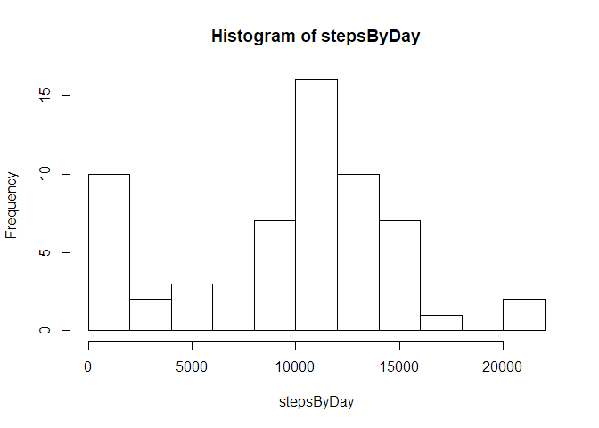
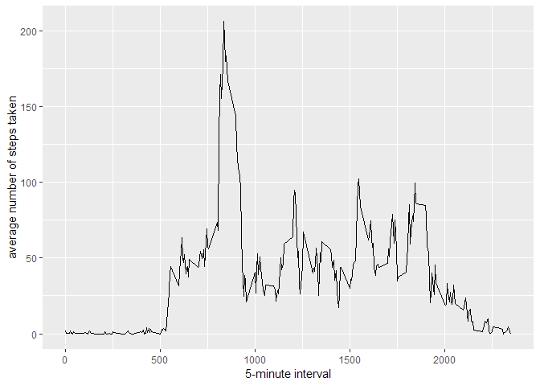
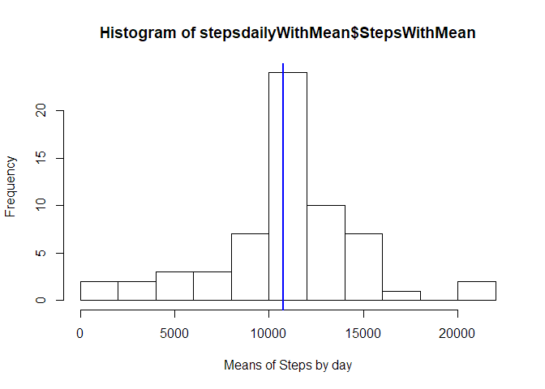
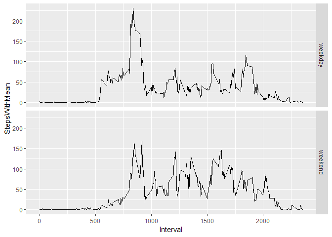

# 1. Loading and preprocessing the data
Show any code that is needed to:

1. Load the data (i.e. \color{red}{\verb|read.csv()|}read.csv())


```r
if(!file.exists('activity.csv')){
    unzip('activity.zip')
}
activityData <- read.csv('activity.csv', header = TRUE, colClasses = c("numeric", "Date", "numeric"))
```

2. Process/transform the data (if necessary) into a format suitable for your analysis


```r
head(activityData)
```

```
##   steps       date interval
## 1    NA 2012-10-01        0
## 2    NA 2012-10-01        5
## 3    NA 2012-10-01       10
## 4    NA 2012-10-01       15
## 5    NA 2012-10-01       20
## 6    NA 2012-10-01       25
```

# 2. What is mean total number of steps taken per day?
For this part of the assignment, you can ignore the missing values in the dataset.

1. Calculate the total number of steps taken per day

```r
stepsByDay <- tapply(activityData$steps, activityData$date, sum, breaks=10, na.rm=TRUE)

head(stepsByDay)
```

```
## 2012-10-01 2012-10-02 2012-10-03 2012-10-04 2012-10-05 2012-10-06 
##         10        136      11362      12126      13304      15430
```


2. If you do not understand the difference between a histogram and a barplot, research the difference between them. Make a histogram of the total number of steps taken each day


```r
hist(stepsByDay,breaks = 10)
```

<!-- -->

3. Calculate and report the mean and median of the total number of steps taken per day


```r
mean(stepsByDay)
```

```
## [1] 9364.23
```

```r
median(stepsByDay)
```

```
## [1] 10405
```

# 3. What is the average daily activity pattern?

1. Make a time series plot (i.e. \color{red}{\verb|type = "l"|}type="l") of the 5-minute interval (x-axis) and the average number of steps taken, averaged across all days (y-axis)


```r
averages <- aggregate(x=list(steps=activityData$steps), by=list(interval=activityData$interval),
                      FUN=mean, na.rm=TRUE)

head(averages)
```

```
##   interval     steps
## 1        0 1.7169811
## 2        5 0.3396226
## 3       10 0.1320755
## 4       15 0.1509434
## 5       20 0.0754717
## 6       25 2.0943396
```

```r
ggplot(data=averages, aes(x=interval, y=steps)) +
    geom_line() +
    xlab("5-minute interval") +
    ylab("average number of steps taken")
```

<!-- -->


2. Which 5-minute interval, on average across all the days in the dataset, contains the maximum number of steps?

```r
averages[which.max(averages$steps),]
```

```
##     interval    steps
## 104      835 206.1698
```

#4. Imputing missing values
Note that there are a number of days/intervals where there are missing values (coded as \color{red}{\verb|NA|}NA). The presence of missing days may introduce bias into some calculations or summaries of the data.

1. Calculate and report the total number of missing values in the dataset (i.e. the total number of rows with \color{red}{\verb|NA|}NAs)


```r
missingValue <- is.na(activityData$steps)
```


```r
table(missingValue)
```

```
## missingValue
## FALSE  TRUE 
## 15264  2304
```


2. Devise a strategy for filling in all of the missing values in the dataset. The strategy does not need to be sophisticated. For example, you could use the mean/median for that day, or the mean for that 5-minute interval, etc.


```r
##first I add a column which i will fill with mean the NA values
activityData$stepsNNA <- c(activityData$steps)
```

I have added a new column where I can put the average values without modifying the original column name steps. Now, I will merge both dataframes, the original one (activity.csv) and averages that i have already created into a new one called activityFull. 


```r
## second, I add the averages by interval already calculated

activityFull <- activityData%>%left_join(averages, by = 'interval')
```


Let's take a look at the head of the newdata frame:

```r
head(activityFull)
```

```
##   steps.x       date interval stepsNNA   steps.y
## 1      NA 2012-10-01        0       NA 1.7169811
## 2      NA 2012-10-01        5       NA 0.3396226
## 3      NA 2012-10-01       10       NA 0.1320755
## 4      NA 2012-10-01       15       NA 0.1509434
## 5      NA 2012-10-01       20       NA 0.0754717
## 6      NA 2012-10-01       25       NA 2.0943396
```

As long as you can see, now we have a column named steps.x (from the original set) and steps.y (from the average dataframe). Now we are going to replace all missing values of the column stepsNNA of activityFull with average values from the column steps.y


```r
activityFull$stepsNNA <- ifelse(is.na(activityFull$stepsNNA), activityFull$steps.y, activityFull$stepsNNA)

head(activityFull)
```

```
##   steps.x       date interval  stepsNNA   steps.y
## 1      NA 2012-10-01        0 1.7169811 1.7169811
## 2      NA 2012-10-01        5 0.3396226 0.3396226
## 3      NA 2012-10-01       10 0.1320755 0.1320755
## 4      NA 2012-10-01       15 0.1509434 0.1509434
## 5      NA 2012-10-01       20 0.0754717 0.0754717
## 6      NA 2012-10-01       25 2.0943396 2.0943396
```
Let's check missing values in the column stepsNNA:


```r
missingStep <- is.na(activityFull$stepsNNA)

table(missingStep)
```

```
## missingStep
## FALSE 
## 17568
```

3. Create a new dataset that is equal to the original dataset but with the missing data filled in.

Now, I proceed to eliminate those columns that I do not need anymore, first column activityFull$steps.y (numbered 5) and then column activityFull$steps.y (numbered 1)


```r
activityFull <- activityFull[,-5]
activityFull <- activityFull[,-1]
```

Let's take a look to the new dataframe


```r
head(activityFull)
```

```
##         date interval  stepsNNA
## 1 2012-10-01        0 1.7169811
## 2 2012-10-01        5 0.3396226
## 3 2012-10-01       10 0.1320755
## 4 2012-10-01       15 0.1509434
## 5 2012-10-01       20 0.0754717
## 6 2012-10-01       25 2.0943396
```

Now, I change the name of the columns in order to give a proper name


```r
colnames(activityFull) <- c("Date", "Interval", "StepsWithMean")

head(activityFull)
```

```
##         Date Interval StepsWithMean
## 1 2012-10-01        0     1.7169811
## 2 2012-10-01        5     0.3396226
## 3 2012-10-01       10     0.1320755
## 4 2012-10-01       15     0.1509434
## 5 2012-10-01       20     0.0754717
## 6 2012-10-01       25     2.0943396
```

4. Make a histogram of the total number of steps taken each day and Calculate and report the mean and median total number of steps taken per day. Do these values differ from the estimates from the first part of the assignment? What is the impact of imputing missing data on the estimates of the total daily number of steps?


```r
stepsdailyWithMean <- aggregate(StepsWithMean ~ Date, data = activityFull, sum)

head(stepsdailyWithMean)
```

```
##         Date StepsWithMean
## 1 2012-10-01      10766.19
## 2 2012-10-02        126.00
## 3 2012-10-03      11352.00
## 4 2012-10-04      12116.00
## 5 2012-10-05      13294.00
## 6 2012-10-06      15420.00
```


```r
hist(stepsdailyWithMean$StepsWithMean,breaks = 10, xlab = "Means of Steps by day")
abline(v = mean(stepsdailyWithMean$StepsWithMean), col = "red", lwd = 2)
abline(v = median(stepsdailyWithMean$StepsWithMean), col = "blue", lwd = 2)
```

<!-- -->

There is a difference in the mean and the median of steps now that we have replaced the missing values with the mean. Let's take a look:

The difference in the mean is:

```r
x <- mean(stepsByDay)-mean(stepsdailyWithMean$StepsWithMean)
x
```

```
## [1] -1401.959
```

The difference in the median is:

```r
y <- median(stepsByDay)-median(stepsdailyWithMean$StepsWithMean)
y
```

```
## [1] -361.1887
```

#5. Are there differences in activity patterns between weekdays and weekends?
For this part the \color{red}{\verb|weekdays()|}weekdays() function may be of some help here. Use the dataset with the filled-in missing values for this part.

1. Create a new factor variable in the dataset with two levels - "weekday" and "weekend" indicating whether a given date is a weekday or weekend day.

```r
activityFull$WeekDay <- ifelse(weekdays(activityFull$Date)%in% c("Saturday", "Sunday"), "weekend", "weekday")

head(activityFull)
```

```
##         Date Interval StepsWithMean WeekDay
## 1 2012-10-01        0     1.7169811 weekday
## 2 2012-10-01        5     0.3396226 weekday
## 3 2012-10-01       10     0.1320755 weekday
## 4 2012-10-01       15     0.1509434 weekday
## 5 2012-10-01       20     0.0754717 weekday
## 6 2012-10-01       25     2.0943396 weekday
```


2. Make a panel plot containing a time series plot (i.e. \color{red}{\verb|type = "l"|}type="l") of the 5-minute interval (x-axis) and the average number of steps taken, averaged across all weekday days or weekend days (y-axis). See the README file in the GitHub repository to see an example of what this plot should look like using simulated data.


```r
stepsbyweekday <- aggregate(StepsWithMean ~ Interval + WeekDay, data = activityFull, mean)

head(stepsbyweekday)
```

```
##   Interval WeekDay StepsWithMean
## 1        0 weekday    2.25115304
## 2        5 weekday    0.44528302
## 3       10 weekday    0.17316562
## 4       15 weekday    0.19790356
## 5       20 weekday    0.09895178
## 6       25 weekday    1.59035639
```

```r
p <- ggplot(stepsbyweekday, aes(Interval, StepsWithMean)) + geom_line()
            
            p + facet_grid(WeekDay ~ .)
```

<!-- -->
